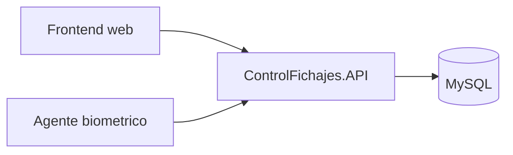

# Documentacion de ControlFichajes.API

Esta boveda contiene las guias de la API. Empezar por [[Inicio|el indice]].

```mermaid
flowchart LR
    Web["Frontend web"] --> API["ControlFichajes.API"]
    Agent["Agente biometrico"] --> API
    API --> DB[("MySQL")]
```
